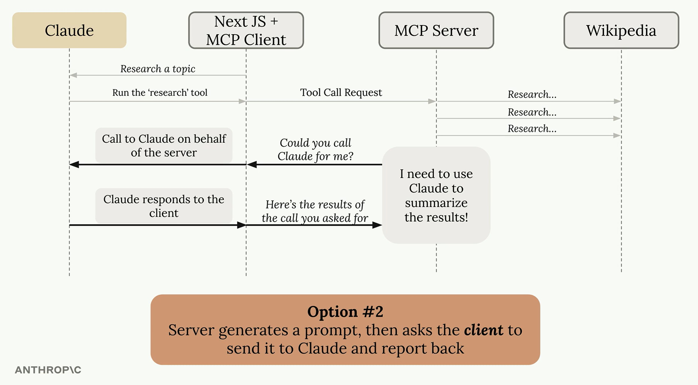

# Advanced MCP Features

## 1. Sampling

Sampling allows an MCP server to **delegate LLM calls to the client**, rather than making them directly.

```
Normal flow:   Client ──> Server ──> LLM API
Sampling flow: Client ──> Server ──> Client ──> LLM API ──> Client ──> Server
```

The server sends a prompt to the client, which uses its existing LLM configuration to run the model and return the result.

**Benefits:**
- Server needs no API keys or LLM setup
- API cost and configuration burden stays with the client
- Recommended for publicly accessible MCP servers



**Client setup:** `sampling_callback`

---

## 2. Progress Notifications

Servers can emit real-time status updates to the client during long-running tasks.

**Key methods:**

| Method | Purpose |
|--------|---------|
| `context.info()` | Send a log message to the client |
| `context.report_progress(current, total)` | Report incremental progress (e.g., `70/100`) |

**Client-side presentation options:**

| Environment | Approach |
|-------------|----------|
| CLI | Print messages and progress to the terminal |
| Web app | Push updates via WebSockets, SSE, or polling |
| Desktop app | Update a progress bar in the UI |

**Client setup:** `logging_callback`, `print_progress_callback`

---

## 3. Roots

Roots let users explicitly grant the server access to specific files or directories.

```
Client exposes list_roots ──> Server calls list_roots ──> Server acts only on returned paths
```

**Benefits:**
- **Security** — restricts filesystem access to what the user explicitly permits
- **Convenience** — users reference files by a simple name rather than full absolute paths
- **Focus** — helps the LLM target relevant directories instead of searching the entire filesystem

---

## Why `async`, `await`, and Callbacks?

MCP involves continuous, bidirectional communication — responses aren't instant, and neither side should block while waiting.

| Concept | Role |
|---------|------|
| `async` | Marks a function as asynchronous, allowing Python to run other code while waiting for a result |
| `await` | Pauses an async function at a slow operation (e.g., network I/O) without blocking the program |
| Callbacks | Registered in advance by the client to handle server-initiated messages (progress, sampling requests) whenever they arrive |
